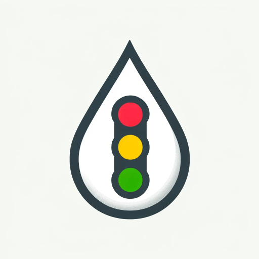

# Panketaler Wasserampel für Home Assistant



Diese Integration für Home Assistant zeigt den aktuellen Status der Wasserampel der Gemeinde Panketal an.

## Unterstütze das Projekt

Wenn dir diese Integration gefällt und du meine Arbeit unterstützen möchtest, kannst du mir gerne einen Kaffee spendieren:

<a href="https://buymeacoffee.com/morbeth" target="_blank">
  
</a>

## Installation

### Option 1: HACS (Home Assistant Community Store)

#### Voraussetzungen
- [HACS](https://hacs.xyz/) muss bereits in Home Assistant installiert sein.

#### Installation über HACS
1. Gehe in Home Assistant zur HACS-Seite
2. Klicke auf "Integrationen"
3. Klicke auf das Menü (drei Punkte) in der oberen rechten Ecke
4. Wähle "Benutzerdefiniertes Repository hinzufügen"
5. Füge folgende Informationen ein:
   - Repository URL: `https://github.com/morbeth/panketaler-wasserampel`
   - Kategorie: Integration
6. Klicke auf "Hinzufügen"
7. Nach kurzer Zeit erscheint die "Panketaler Wasserampel" in der Liste der verfügbaren Integrationen
8. Klicke auf "Panketaler Wasserampel"
9. Klicke unten rechts auf "Herunterladen"
10. Starte Home Assistant neu (oben rechts unter "Server Controls" → "Restart")

### Option 2: Manuelle Installation

1. Lade den Inhalt des Repositories als ZIP-Datei herunter
2. Entpacke die ZIP-Datei
3. Kopiere den Ordner `custom_components/panketaler_wasserampel` in dein Home Assistant Verzeichnis `/config/custom_components/`
4. Starte Home Assistant neu

## Konfiguration

### Option 1: Über die UI (empfohlen)

1. Gehe in Home Assistant zu Einstellungen → Geräte & Dienste
2. Klicke auf "Integration hinzufügen"
3. Suche nach "Panketaler Wasserampel"
4. Folge den Anweisungen im Setup-Assistenten

### Option 2: YAML Konfiguration

Füge folgendes in deine `configuration.yaml` Datei ein:

```yaml
sensor:
  - platform: panketaler_wasserampel
    name: Panketaler Wasserampel
    url: http://www.eigenbetrieb-panketal.de/wassersparen/
```

Starte Home Assistant neu, nachdem du die Konfiguration hinzugefügt hast.

## Features

- Zeigt den aktuellen Status der Wasserampel an (grün, gelb, rot)
- Bietet einen numerischen Sensor (1=grün, 2=gelb, 3=rot) für Automatisierungen
- Unterstützt Übersetzungen (Deutsch, Englisch)
- Automatische Aktualisierung der Daten (stündlich)

## Anzeige in der Lovelace UI

Hier ist ein Beispiel, wie du die Wasserampel in deine Lovelace UI einbinden kannst:

```yaml
type: entities
title: Wasserverbrauch
entities:
  - entity: sensor.panketaler_wasserampel
    name: Aktuelle Wasserampel
  - entity: sensor.panketaler_wasserampel_numerisch
    name: Wasserampel (numerisch)
```

## Automatisierungsbeispiel

```yaml
automation:
  - alias: "Benachrichtigung bei Wassersperre"
    trigger:
      - platform: state
        entity_id: sensor.panketaler_wasserampel_numerisch
        to: "3"
    action:
      - service: notify.mobile_app
        data:
          title: "Achtung: Wasserampel auf ROT!"
          message: "Die Wasserampel Panketal steht auf ROT. Wassernutzung im Außenbereich verboten!"
```

## Fehlerbehebung

### Die Wasserampel zeigt "Unbekannt" an
- Überprüfe die Internetverbindung deines Home Assistant Systems
- Prüfe, ob die Webseite der Gemeinde Panketal erreichbar ist
- Schau in die Home Assistant Logs, um mögliche Fehler zu identifizieren

### Die Integration erscheint nicht in HACS
- Stelle sicher, dass du die Repository-URL korrekt eingegeben hast
- Prüfe, ob du die richtige Kategorie (Integration) ausgewählt hast
- Versuche, den Browser-Cache zu leeren und die HACS-Seite neu zu laden

## Datenschutz und Haftungsausschluss

Diese Integration ruft lediglich öffentlich zugängliche Daten von der Webseite der Gemeinde Panketal ab. Es werden keine persönlichen Daten gesammelt oder übertragen. Die Nutzung erfolgt auf eigene Gefahr.

## Aktualisierungen

Über HACS wirst du automatisch benachrichtigt, wenn Updates für diese Integration verfügbar sind.

## Autor

Gunnar Neuendorf (@morbeth)

## Lizenz

MIT
